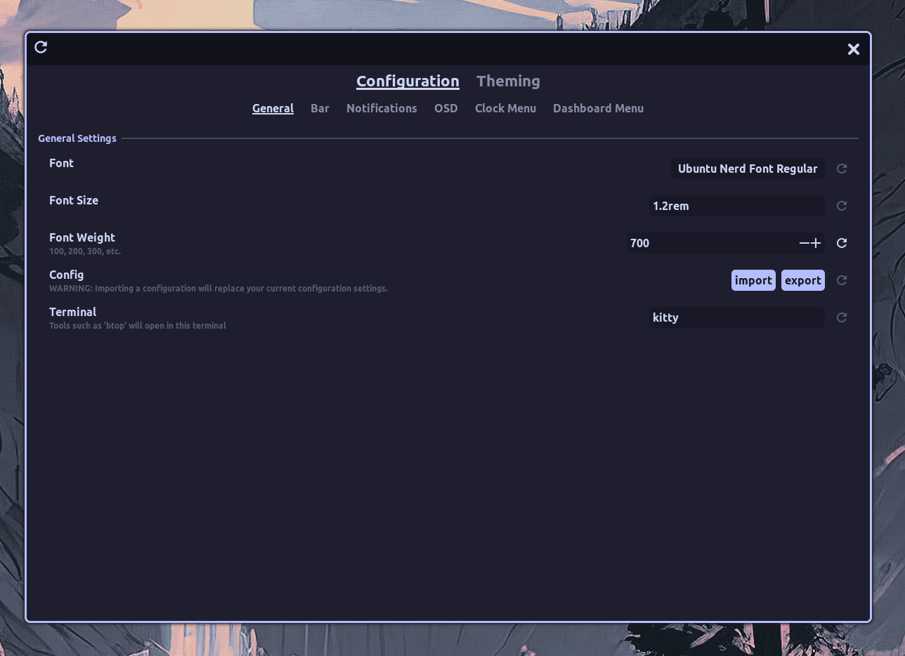

# Panel Configuration

The `Configuration` tab of settings dialog allows you to configure the behavior of the HyprPanel. You can access the Configuration tab by clicking the category `Configuration` in the settings dialog.



The Configuration tab contains the following categories that you can configure.

## General

The **General** tab contains your font settings and your default terminal. The font size you select will determine the scaling of your entire panel.

The **Default Terminal** determines which terminal emulator to use when opening a terminal command from the panel.

Additionally, this is where you can **Import** or **Export** your HyprPanel configuration.

### Scaling

The scaling section allows you to scale all the different aspects of the panel individually.

Additionally in this section, you can configure the **Scaling Priority**. Scaling priority helps GDK - which HyprPanel uses - to determine how pixels on the screen are calculated so it can spawn menus at the right location (where the button is clicked).

In most scenarios, the default setting of `gdk` should work fine. However, if you notice that your drop-down menus are spawning at the wrong location or outside of your screen, you can try changing the scaling priority to `hyprland` or `both` and see if it resolves your issue.

## Bar

This is where you can configure the behavior of the panel bar. The options in this tab let you configure the panel's behavior and the settings of all the modules that are displayed on the bar.

### Layouts

The **Layouts** section allows you to configure the layout of the panel. If you want to display specific modules in a specific order, you can do so by defining a layout object that configures the layout of your bar for each monitor. By default, the layout is as follows:

```json
{
  "0": {
    "left": ["dashboard", "workspaces", "windowtitle"],
    "middle": ["media"],
    "right": [
      "volume",
      "network",
      "bluetooth",
      "systray",
      "clock",
      "notifications"
    ]
  },
  "1": {
    "left": ["dashboard", "workspaces", "windowtitle"],
    "middle": ["media"],
    "right": ["volume", "clock", "notifications"]
  },
  "2": {
    "left": ["dashboard", "workspaces", "windowtitle"],
    "middle": ["media"],
    "right": ["volume", "clock", "notifications"]
  }
}
```

Additionally, you can also use a combination of a wild-card to apply the layout to all monitors not explicitly defined. You can mix monitor indices and connector names in the same configuration. For example, if you want to apply the same layout to all monitors EXCEPT monitor 2 and your HDMI display, you can define the layout as follows:

```json
{
  "*": {
    "left": ["dashboard", "workspaces", "windowtitle"],
    "middle": ["media"],
    "right": [
      "volume",
      "network",
      "bluetooth",
      "systray",
      "clock",
      "notifications"
    ]
  },
  "2": {
    "left": ["dashboard", "workspaces", "windowtitle"],
    "middle": ["media"],
    "right": ["volume", "clock", "notifications"]
  },
  "HDMI-A-1": {
    "extends": "*",
    "middle": []
  }
}
```

The numbers `0`, `1`, and `2` represent the monitor index. Alternatively, you can use the monitor's connector name (e.g., `"DP-1"`, `"HDMI-A-1"`) as the key. The `left`, `middle`, and `right` keys represent the modules that will be displayed on the left, middle, and right side of the panel, respectively. Each section (left, middle, right) is an array of module names that will be displayed in the order they are listed. You can select from the following modules:

```text
"separator"
"battery"
"dashboard"
"workspaces"
"windowtitle"
"media"
"notifications"
"volume"
"network"
"bluetooth"
"clock"
"systray"
"microphone"
"ram"
"cpu"
"cputemp"
"storage"
"netstat"
"kbinput"
"updates"
"weather"
"submap"
"hyprsunset"
"hypridle"
"power"
"cava"
```

#### Extending Layouts

You can use the `extends` property to inherit configuration from another layout. This is useful when you want to have a base layout and only override specific sections for certain monitors. The `extends` property should reference another layout key (monitor index, connector name, or wildcard).

When using `extends`, any sections (`left`, `middle`, `right`) that are not defined in the current layout will be inherited from the extended layout. If a section is defined, it will override the entire section from the extended layout.

Example using extends:

```json
{
  "*": {
    "left": ["dashboard", "workspaces", "windowtitle"],
    "middle": ["media"],
    "right": [
      "volume",
      "network",
      "bluetooth",
      "systray",
      "clock",
      "notifications"
    ]
  },
  "DP-1": {
    "extends": "*",
    "right": ["volume", "clock", "notifications"]
  },
  "HDMI-A-1": {
    "extends": "*",
    "left": ["workspaces"],
    "middle": []
  }
}
```

In this example:

- The wildcard layout (`*`) defines the default configuration
- The `DP-1` monitor extends the wildcard layout but overrides only the `right` section
- The `HDMI-A-1` monitor extends the wildcard layout but overrides the `left` and `middle` sections

#### Hiding the Bar on specific monitors

You may decide that you only want to display the bar on your primary monitor; you can hide the bar on any monitor by assigning an empty array to each section.

In the following example, if your primary monitor is `"0"`, you can hide the bar on monitors `"1"` and `"2"` by setting the layout as follows:

```json
{
  "0": {
    "left": ["dashboard", "workspaces", "windowtitle"],
    "middle": ["media"],
    "right": [
      "volume",
      "network",
      "bluetooth",
      "systray",
      "clock",
      "notifications"
    ]
  },
  "1": {
    "left": [],
    "middle": [],
    "right": []
  },
  "2": {
    "left": [],
    "middle": [],
    "right": []
  }
}
```

### Spacing

This section allows you to configure the spacing of the bar and the modules inside of it. This is also where you can configure your bar to be floating or docked. If your bar is floating, you can configure the position of the bar on the screen and the radius of the corners.

### Dashboard

This section allows you to change the icon of your dashboard module in the bar if you're not using **Arch by the way**.

### Workspaces

This section allows you to configure the behavior of the workspace module. You can configure the number of workspaces, how workspaces are represented, whether the workspace module should display the workspaces specific to the monitors, the scroll behavior, and the workspace icon spacing.

#### Show Workspace Icons

Additionally, you can assign each workspace a custom icon by enabling the `Show Workspace Icons` option. You can also assign a custom color to each workspace by providing the color alongside the icon.

To define an icon for a workspace, you can either use simple `key: value` pairs - if you don't want to assign a custom color. Ex:

```json
{
  "1": "󰄛",
  "2": "",
  "3": "󰙯",
  "4": "󰓇",
  "5": ""
}
```

This will assign the firefox icon to workspace 2, discord icon to workspace 3, and so on.

If you desire to change the color of each icon, then you can use the following layout where you can specify the icon and the color of the icon. Ex:

```json
{
  "1": { "icon": "󰄛", "color": "red" },
  "2": { "icon": "", "color": "#94e2d5" },
  "3": { "icon": "󰙯", "color": "rgb(166, 227, 161)" },
  "4": { "icon": "󰓇", "color": "green" },
  "5": { "icon": "", "color": "yellow" }
}
```

You can also mix and match the two layouts:

```json
{
  "1": "󰄛",
  "2": { "icon": "", "color": "#94e2d5" },
  "3": { "icon": "󰙯", "color": "rgb(166, 227, 161)" },
  "4": "󰓇",
  "5": ""
}
```

#### Map Workspaces to Application Icons

::: info
This setting relies on `Map Workspaces to Icons` to be enabled
:::

This setting enables the ability to show active windows in the workspace indicator module instead of static icons.

You can assign custom icons to applications by defining rules in the `App Icon Mappings` field. This field takes a JSON object which by default defines an icon for a hyprland window class.

For example, if you would like to assign rules for **Discord**, **YouTube** and **Wezterm** you can do so as follows:

```json
{
  "[dD]iscord": "󰙯",
  "title:YouTube": "",
  "class:wezterm$": ""
}
```

In this example, the discord app icon will be automatically applied to any application open that has the class name d(D)iscord - aka the discord app only; same for wezterm.

However, for the YouTube icon, that will be applied to any application that has a title of `YouTube`. In other words, if you have an active tab open in your browser pointing to youtube.com, it will show the youtube icon.

This ruleset allows you to define icons based off of the window's class (default) or title in a similar way to Hyprland. You can find the titles and classes of you current windows by using the command:

```
hyprctl clients
```

::: tip
You can still define colors in your `Workspace Icon & Color Mappings` in conjunction with this setting to apply workspace specific icon colors - despite them being dynamic.
:::
::: warning
A default list of icon mappings are provided but are not exhaustive. You may have to provide your own.
:::

### Window Titles

Window titles display the name of the currently focused window. This section lets you configure the spacing between the icon and the label/name of the currently focused window.

#### Window Title Mappings

Window title mappings allow you to assign a specific icon and a name to specified window in the window titles bar module. This mapping is an array of arrays where each array contains the following:

- The **original window title** in all lowercase (can be a regular expression)
- The **icon** to display
- The **replacement window title** to display

Example of window mappings - notice that the nerd font icon may not render correctly in the browser:

```json
[
  ["kitty", "󰄛", "Kitty Terminal"],
  ["firefox", "󰈹", "Firefox"],
  ["microsoft-edge.*", "󰇩", "Edge"],
  ["discord", "", "Discord"],
  ["org.kde.dolphin", "", "Dolphin"]
]
```

Note that you must provide the original window title in all **_lowercase_**. If you have nothing mapped to a specific window title, the default window title will be displayed in the module.

### Volume

This section allows you to configure the volume module. You can configure the inner spacing and toggle the volume label.

### Network

The network module displays your network status. This section allows you to configure the inner spacing, toggle the network label and determine the truncation of the network name.

### Bluetooth

The bluetooth module displays your bluetooth status. This section allows you to configure the inner spacing and toggle the bluetooth label.

### System Tray

The system tray module displays icons for processes running in the background. In this section you can configure which icons to blacklist from displaying in the system tray. Additionally, you can assign custom icons and colors to tray applications.

#### Ignore List

The **Ignore List** field allows you to specify which icons you do not want to display in the system tray. This field is an array of strings that should contain the names of the applications you want to ignore.

Names for applications are **case-sensitive** and must match the name of the application. You can find the name of an application by middle clicking the system tray icon which will create a notification with the application name.

For example, if you want to ignore the Spotify icon, you would enter the following into the `Ignore List` field:

```bash
["spotify-client"]
```

#### Custom Systray Icons

The **Custom Systray Icons** field lets you define a JSON map to assign custom icons to applications. The format of this object is as follows:

```ts
{
    "appId_or_regex" : {
        "icon": "󰙯",
        "color": "#b4befe",
        "size": "1.3em"
    }
}
```

Where `appId` can be either a specific application ID string or a regex pattern that matches multiple application IDs.

You can use a Hyprpanel provided method to get a list of ALL application IDs currently in the tray by running the following command:

```sh
hyprpanel systrayItems
```

To give you an example, if you wanted to assign a specific icon to Spotify and Steam, you could do so by defining these rules:

```ts
{
  "steam": { "icon": "󰓓", "color": "#89b4fa" },
  "spotify-client": { "icon": "󰓇", "color": "#94e2d5" }
}
```

:::tip
You do not have to define a color for the icons. Not doing so will automatically use the color defined in `Theming > Bar > System Tray > Custom Icons`.
:::

### Clock

You can define the format of the clock displayed in the clock module in this section. This format is the strftime() format language as specified by c99.

Here are all the time format specifiers:

```bash
%a: the abbreviated weekday name according to the current locale
%A: the full weekday name according to the current locale
%b: the abbreviated month name according to the current locale
%B: the full month name according to the current locale
%c: the preferred date and time representation for the current locale
%C: the century number (year/100) as a 2-digit integer (00-99)
%d: the day of the month as a decimal number (range 01 to 31)
%e: the day of the month as a decimal number (range 1 to 31); single digits are preceded by a figure space (U+2007)
%F: equivalent to `Y-%m-%d` (the ISO 8601 date format)
%g: the last two digits of the ISO 8601 week-based year as a decimal number (00-99). This works well with V and %u.
%G: the ISO 8601 week-based year as a decimal number. This works well with V and %u.
%h: equivalent to %b
%H: the hour as a decimal number using a 24-hour clock (range 00 to 23)
%I: the hour as a decimal number using a 12-hour clock (range 01 to 12)
%j: the day of the year as a decimal number (range 001 to 366)
%k: the hour (24-hour clock) as a decimal number (range 0 to 23); single digits are preceded by a figure space (U+2007)
%l: the hour (12-hour clock) as a decimal number (range 1 to 12); single digits are preceded by a figure space (U+2007)
%m: the month as a decimal number (range 01 to 12)
%M: the minute as a decimal number (range 00 to 59)
%f: the microsecond as a decimal number (range 000000 to 999999)
%p: either ‘AM’ or ‘PM’ according to the given time value, or the corresponding strings for the current locale. Noon is treated as ‘PM’ and midnight as ‘AM’. Use of this format specifier is discouraged, as many locales have no concept of AM/PM formatting. Use %c or X instead.
%P: like %p but lowercase: ‘am’ or ‘pm’ or a corresponding string for the current locale. Use of this format specifier is discouraged, as many locales have no concept of AM/PM formatting. Use %c or X instead.
%r: the time in a.m. or p.m. notation. Use of this format specifier is discouraged, as many locales have no concept of AM/PM formatting. Use %c or X instead.
%R: the time in 24-hour notation (H`:`M)
%s: the number of seconds since the Epoch, that is, since 1970-01-01 00:00:00 UTC
%S: the second as a decimal number (range 00 to 60)
%t: a tab character
%T: the time in 24-hour notation with seconds (H`:`M`:`S)
%u: the ISO 8601 standard day of the week as a decimal, range 1 to 7, Monday being 1. This works well with G and V.
%V: the ISO 8601 standard week number of the current year as a decimal number, range 01 to 53, where week 1 is the first week that has at least 4 days in the new year. See g_date_time_get_week_of_year(). This works well with G and %u.
%w: the day of the week as a decimal, range 0 to 6, Sunday being 0. This is not the ISO 8601 standard format — use %u instead.
%x: the preferred date representation for the current locale without the time
%X: the preferred time representation for the current locale without the date
%y: the year as a decimal number without the century
%Y: the year as a decimal number including the century
%z: the time zone as an offset from UTC (+hhmm)
%:z: the time zone as an offset from UTC (+hh:mm). This is a gnulib strftime() extension. Since: 2.38
%::z: the time zone as an offset from UTC (+hh:mm:ss). This is a gnulib strftime() extension. Since: 2.38
%:::z: the time zone as an offset from UTC, with : to necessary precision (e.g., -04, +05:30). This is a gnulib strftime() extension. Since: 2.38
%Z: the time zone or name or abbreviation
%%: a literal % character
```

### Media

This section allows you to configure the media module. You can configure the inner spacing, the media label, and the truncation of the media name.

### Notifications

This section allows you to configure the notifications module. You can configure the inner spacing and whether or not to show the total number of notifications.

## Notifications

The **Notification Menu** tab allows you to configure the behavior of the notifications that are displayed by the HyprPanel. You can access the Notification Menu tab by clicking the category `Notifications` in the settings dialog.

In the **Notification Menu** tab, you can configure:

- Which applications to ignore
- The position of the notifications toast
- The timeout of the notifications toast
- Which monitor to display the notifications on
- Whether to follow the focused monitor
- Whether or not to preserve actions inside the notifications between sessions
- Actions include buttons that are displayed in the notification that you can click on to perform an action

More information about **notification settings** can be found in the [Notifications](./notifications.md) page.

## OSD (On-Screen Display)

The **OSD** tab allows you to configure the behavior of the on-screen display that is displayed by the HyprPanel. You can access the OSD tab by clicking the category `OSD` in the settings dialog.

The OSD is displayed when you change the volume, brightness, or when you mute your audio. In the **OSD** tab, you can configure:

- Whether to show the OSD
- The orientation of the OSD
- The position of the OSD on the screen
- The monitor on which to display the OSD
- Whether to follow the focused monitor
- The Radius of the OSD corners
- The margin of the OSD from the edge of the screen

More information about **OSD settings** can be found in the [OSD](./osd.md) page.

## Clock Menu

The **Clock Menu** tab allows you to configure the behavior of the clock module that is displayed by the HyprPanel. You can access the Clock Menu tab by clicking the category `Clock Menu` in the settings dialog.

The Clock Menu displays the time, calendar, and the weather. In the **Clock Menu** tab, you can configure:

- Whether to use 24-hour time
- Settings for the weather module
  - The weather location
  - The weather unit
  - The weather API key
    - Instead of plain text, you can also specify a file path to a JSON file that contains the API key in the following format:

      ```json
      {
        "weather_api_key": "your_api_key_goes_here"
      }
      ```

  - The weather refresh rate

The Weather API key is required to fetch weather data. You can get a free API key from [WeatherAPI's Website](https://www.weatherapi.com/)

## Dashboard Menu

The **Dashboard Menu** tab allows you to configure the behavior of the dashboard module that is displayed by the HyprPanel. You can access the Dashboard Menu tab by clicking the category `Dashboard Menu` in the settings dialog.

The Dashboard Menu displays the dashboard, which is a menu that allows you to configure the following.

### Power Menu

The power menu section contains the system power options and the profile card which contains the user profile name and profile picture.

You can configure the following in the Power Menu section:

- The user profile image
- The user profile name
- Enable/Disable confirmation dialog for power operations
- A custom command for the following power options:
  - Shutdown
  - Reboot
  - Sleep
  - Logout

### Resource Usage Metrics

If you have an NVidia GPU, you can enable the GPU usage bar in the dashboard.

### Shortcuts

This section allows you to configure the shortcuts that are displayed in the dashboard. There are a total of 8 shortcuts out of which 6 are user-configurable.

You can configure the following for each of these 6 shortcuts:

- The icon
- The tooltip
- The command

The 2 non-configurable shortcuts are:

- The screen recording shortcut
- The settings shortcut

### Directories

The directories section allows you to configure the directories that are displayed in the dashboard. Although by default, the directories are configured to open the dolphin file manager, you can configure them to open any file manager of your choice at any specified drive. Additionally, you can configure this section to run any command if you desire to not have any directory shortcuts.

Each entry in the directories section contains the following configurable options:

- The Label/Name of the directory
- The command to run when the label is clicked

## Basic Modules

### CPU Temperature

In order to display the CPU Temperature properly, you must first determine the correct CPU sensor for your system. To do that you can use the following command:

```sh
for i in /sys/class/hwmon/hwmon*/temp*_input; do echo "$(<$(dirname $i)/name): $(cat ${i%_*}_label 2>/dev/null || echo $(basename ${i%_*})) $(readlink -f $i)"; done
```

This will generate a list of temperature sensors. For example:

```sh
nvme: Composite /sys/devices/pci0000:00/0000:00:01.1/0000:01:00.0/nvme/nvme0/hwmon0/temp1_input
nvme: Sensor 1 /sys/devices/pci0000:00/0000:00:01.1/0000:01:00.0/nvme/nvme0/hwmon0/temp2_input
nvme: Sensor 2 /sys/devices/pci0000:00/0000:00:01.1/0000:01:00.0/nvme/nvme0/hwmon0/temp3_input
nvme: Composite /sys/devices/pci0000:00/0000:00:01.2/0000:02:00.2/0000:03:00.0/0000:04:00.0/nvme/nvme1/hwmon1/temp1_input
nvme: Sensor 1 /sys/devices/pci0000:00/0000:00:01.2/0000:02:00.2/0000:03:00.0/0000:04:00.0/nvme/nvme1/hwmon1/temp2_input
k10temp: Tctl /sys/devices/pci0000:00/0000:00:18.3/hwmon/hwmon2/temp1_input
k10temp: Tccd1 /sys/devices/pci0000:00/0000:00:18.3/hwmon/hwmon2/temp3_input
```

In this case, `k10temp: Tctl /sys/devices/pci0000:00/0000:00:18.3/hwmon/hwmon2/temp1_input` is the sensor that want to use.

So we can simply copy the file path and supply that to the `CPU Temperature Sensor` field in the settings at `Configuration > Basic Modules > CPU Temperature Sensor`. In this case we would input the following value into the text box:

```sh
/sys/devices/pci0000:00/0000:00:18.3/hwmon/hwmon2/temp1_input
```
