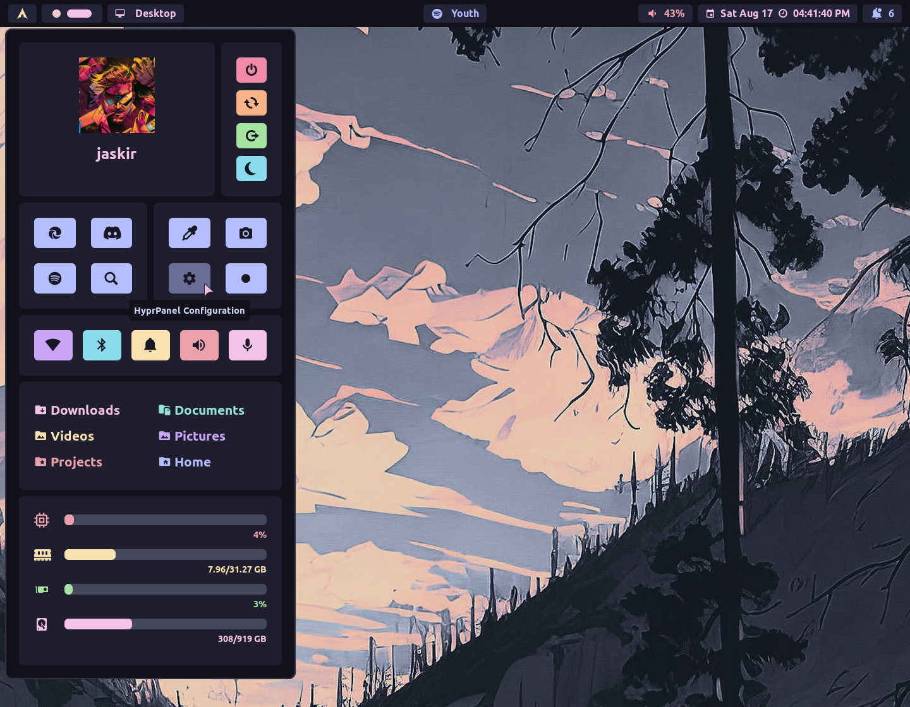

# Settings
Configuring your HyprPanel is extremely easy. The settings dialog contains all of your configuration options - from theming to behavioral configurations. 

You can access the settings dialog by clicking on the **Arch Icon** (default) to open the **Dashboard Menu** and clicking the **Gear** icon.



Additionally, you can toggle the settings dialog by typing the following command in the terminal:
```bash
ags -t settings-dialog
```
