# Theming

HyprPanel comes with pre-built themes that you can choose from.

These themes can be found in the `themes` directory in the root of the project.
You can import these themes from the settings dialog by going to `Theming > General Settings > Import` and selecting a theme from the themes directory.

::: warning
In order to restart the panel in NixOS after importing configs/themes, you must change the restart
command in `Configuration > General > Restart Command` to `hyprpanel -q; hyprpanel`.
:::

The themes directory contains the following themes:

## Catppuccin

### Mocha

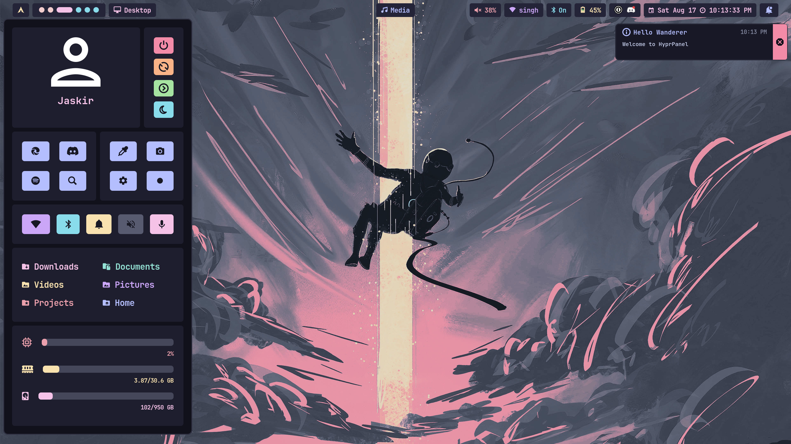

### Macchiato

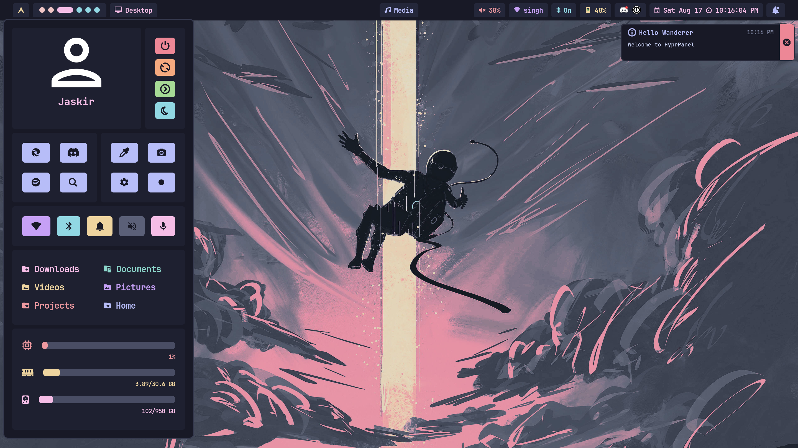

### Frappe

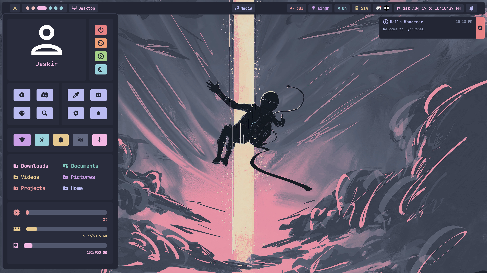

### Latte

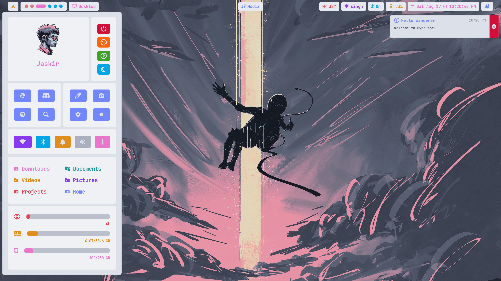

## Nord

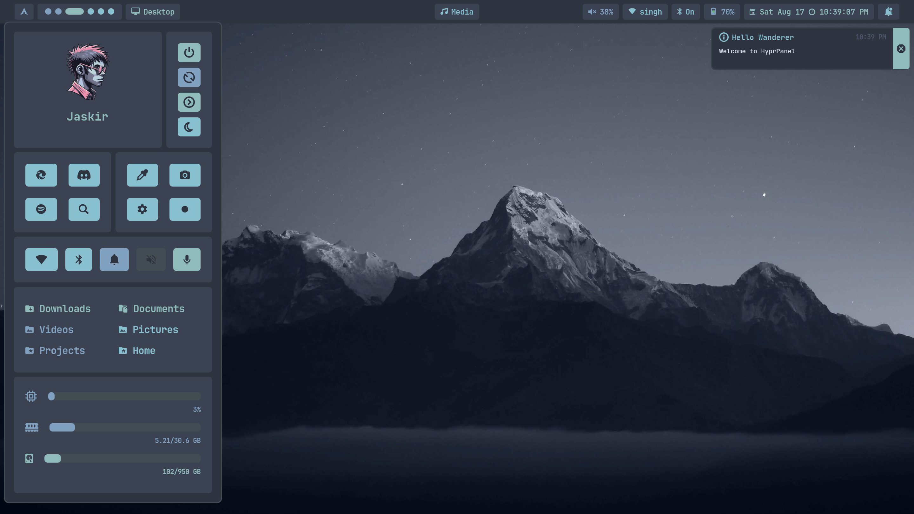

## Gruvbox

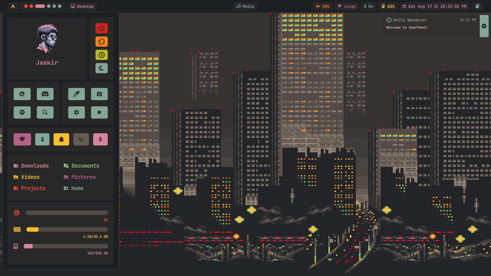

## Rose Pine

### Standard Variant

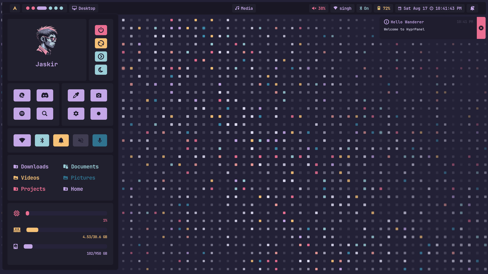

### Moon Variant

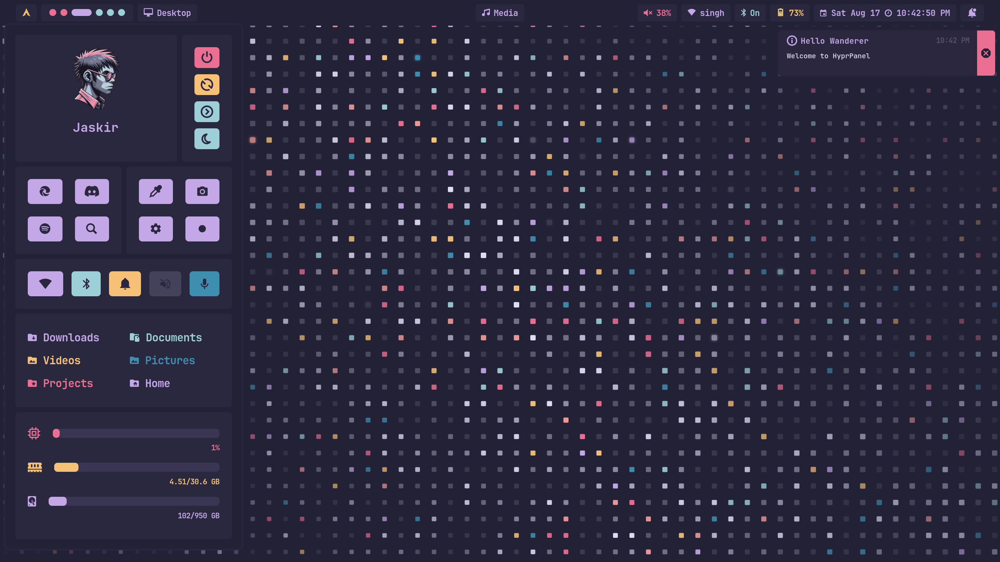

## Tokyo Night

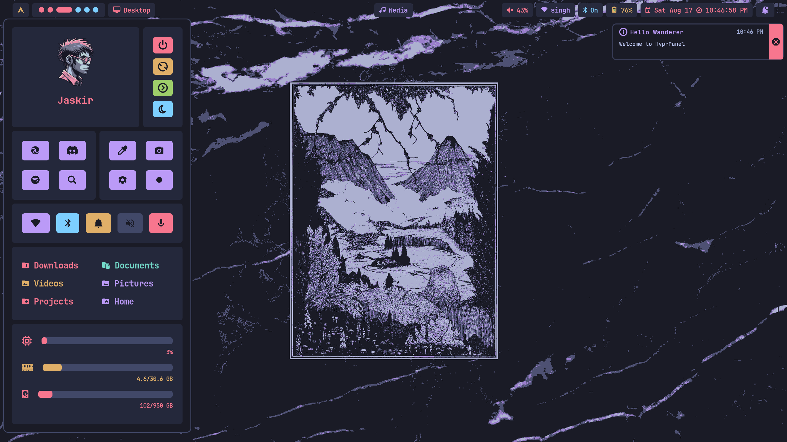

## Dracula

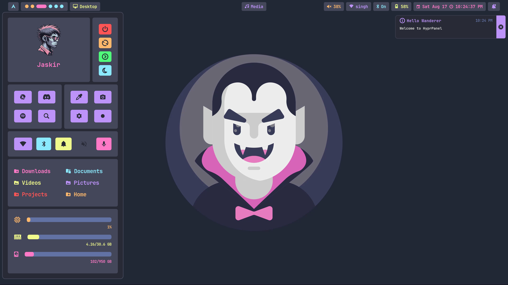

## Everforest (By: [Rishav12s](https://github.com/rishav12s))

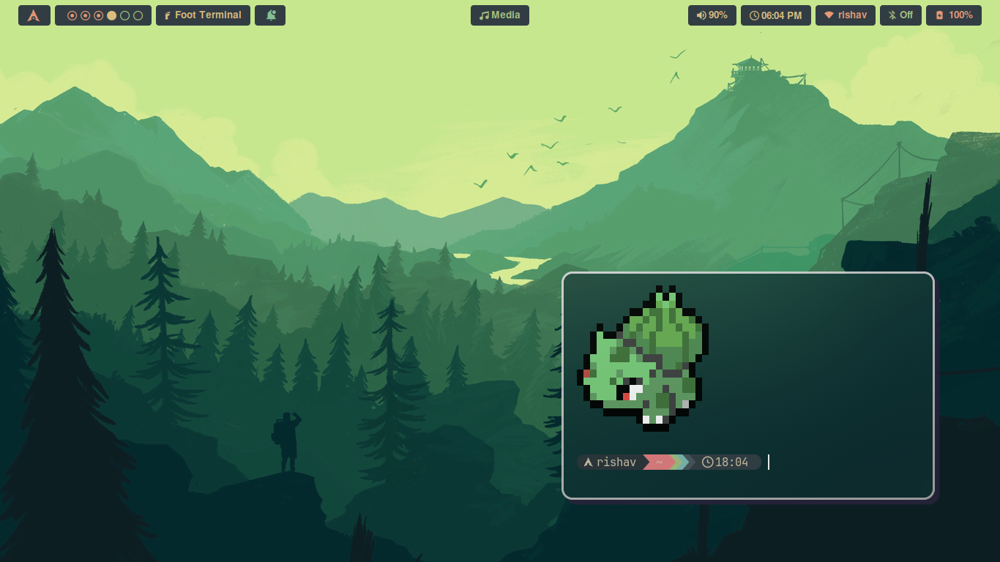

## One Dark (By: [Rishav12s](https://github.com/rishav12s))

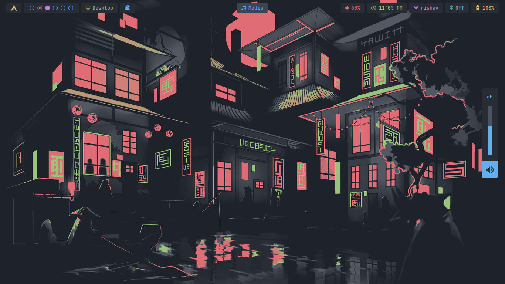

## Cyberpunk (By: [Rishav12s](https://github.com/rishav12s))

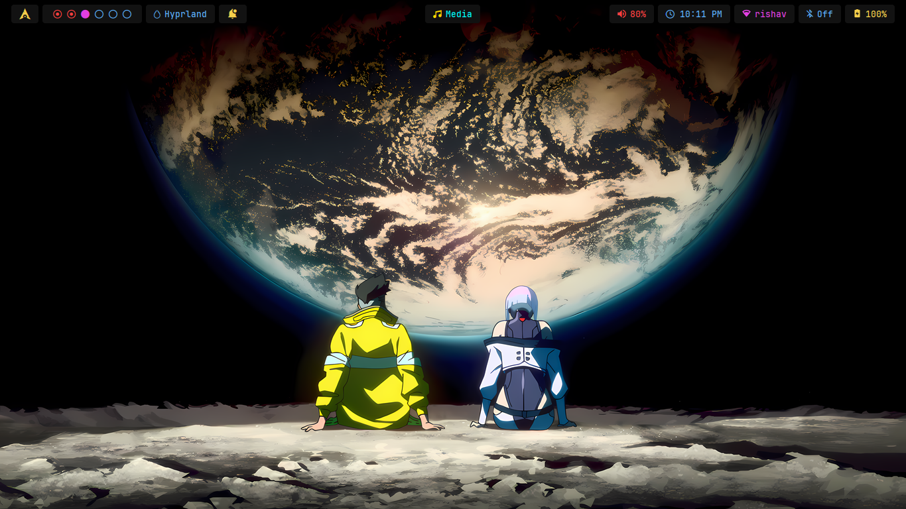

## Monochrome (By: [Rishav12s](https://github.com/rishav12s))

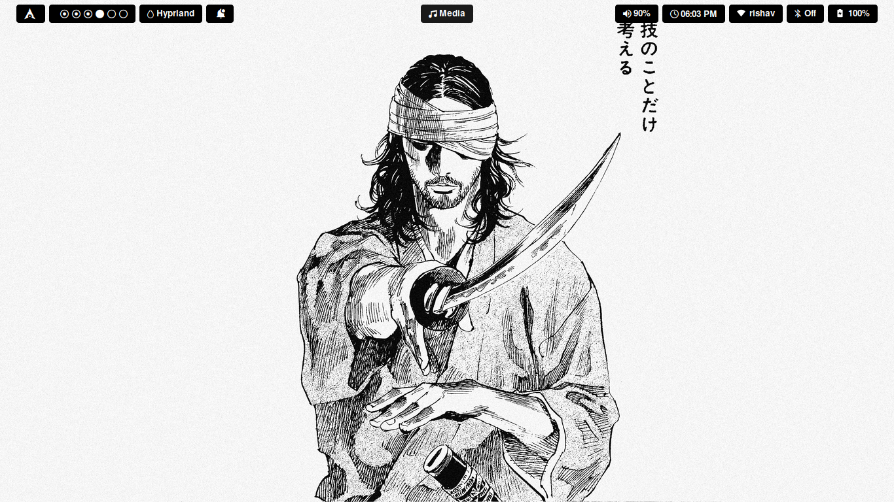
