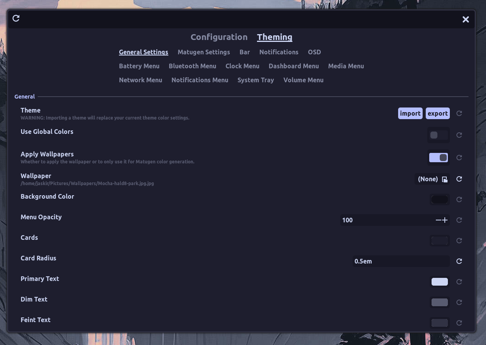

# Theming
HyprPanel is built with theming in mind. It's extremely easy to change the look of your panel and context menus with just a few clicks. 

Every element that you can see on the panel is themable. This includes the background, foreground, icons, text, and context menus, context menu items, and more. 

The theming settings can be found in the Theming section of the settings dialog.

This section is divided into the categories listed below.

## General Settings
The general settings section allows you to configure the generic context menu components of the panel. Additionally, from this section, you can import themes from the themes directory.

## Matugen Settings
The Matugen Settings section allows you to enable wallpaper based theming. This feature allows you to set a wallpaper and have the panel colors adapt to the wallpaper colors. For this feature to work, you need to have a wallpaper set in the General Settings section. The wallpaper doesn't have to be enabled but it must be set to generate the appropriate colors.

This section contains the following settings:

### Enable Matugen
Enables or disables the Matugen feature. You must have the matugen dependency installed for this feature to work.

### Matugen Theme
Lets you choose between the light and dark theme generated from the wallpaper.

### Matugen Scheme
This lets you choose between the different variants of the palette generated from the wallpaper by Matugen.

### Matugen Variation
This is a list of handpicked variations of the generated palette. You can choose between these variations to get the desired look.

### Contrast
The contrast setting allows you to set the contrast of the generated palette. This setting is useful when the generated palette is too bright or too dark.

## Bar
The bar section allows you to configure the panel's background, foreground, and text color.

All the colors of each module in the bar can be configured from this section.

## Notifications
The style of the notifications toast can be configured in this section. 

## OSD
You can configure the style of the on-screen display pop-ups in this section.

## Context Menus
The rest of the sections in the Theming dialog allow you to configure the context menus and context menu items. The context menus and their contents can be configured to have different colors and styles.
